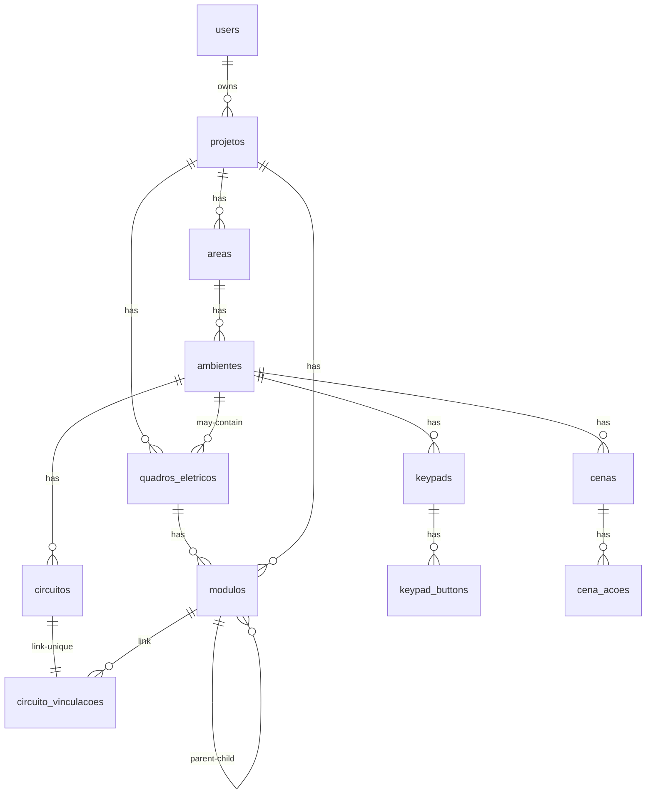

# Banco de Dados — Gerador RWP (Roehn Wizard)

> Este schema alimenta o `standalone_roehn_converter.py`, que converte o **payload JSON** em um projeto `.rwp`.  
> O foco desta documentação é: **o que cada campo significa, restrições, quando é obrigatório e como o script utiliza**.

## Sumário
- [Visão Geral](#visão-geral)
- [Diagrama (alto nível)](#diagrama-alto-nível)
- [Entidades e Campos](#entidades-e-campos)
  - [users](#users)
  - [projetos](#projetos)
  - [areas](#areas)
  - [ambientes](#ambientes)
  - [quadros_eletricos](#quadros_eletricos)
  - [modulos](#modulos)
  - [circuitos](#circuitos)
  - [circuito_vinculacoes](#circuito_vinculacoes)
  - [keypads](#keypads)
  - [keypad_buttons](#keypad_buttons)
  - [cenas](#cenas)
  - [cena_acoes](#cena_acoes)
- [Relacionamentos (resumo)](#relacionamentos-resumo)
- [Regras e Validações Importantes](#regras-e-validacoes-importantes)
- [Mapeamento para o Payload JSON do `src.py`](#mapeamento-para-o-payload-json-do-srcpy)
- [Boas Práticas de Endereçamento (HSNET/DevID)](#boas-práticas-de-endereçamento-hsnetdevid)

---

## Visão Geral
- **Projeto** é a raiz.  
- Dentro dele existem **Áreas** → **Ambientes**.  
- **Quadros Elétricos** pertencem ao Projeto e (opcionalmente) a um Ambiente e contêm **Módulos**.  
- **Circuitos** pertencem a Ambientes e se vinculam a **Módulos** (canal) via **CircuitoVinculacao**.  
- **Keypads** moram nos Ambientes e possuem **Buttons** com configuração (texto, ação, ícone/rocker).  
- **Cenas** são do Ambiente e possuem **Ações** (apontam para circuito/ambiente etc. conforme `action_type`).

---

## Diagrama (alto nível)



> Observação: o diagrama é ilustrativo para entendimento de cardinalidades principais.

---

## Entidades e Campos

# 📋 Tabelas do Schema - Banco de Dados Roehn

### projetos
| Campo | Tipo | Restrições | Valores Aceitos | Default | Obrigatório |
|-------|------|------------|-----------------|---------|-------------|
| `id` | bigint PK | auto-increment | - | - | ✅ |
| `nome` | varchar(120) | `NOT NULL` | Qualquer string | - | ✅ |
| `tech_area` | varchar(100) | `NULL` | Nome da área técnica | 'Área Técnica' | ❌ |
| `tech_room` | varchar(100) | `NULL` | Nome da sala técnica | 'Sala Técnica' | ❌ |
| `board_name` | varchar(100) | `NULL` | Nome do quadro | 'Quadro Elétrico' | ❌ |
| `software_version` | varchar(20) | `NULL` | '1.0.8.67' ou similar | '1.0.8.67' | ❌ |
| `timezone_id` | varchar(50) | `NULL` | 'America/Bahia' ou similar | 'America/Bahia' | ❌ |
| `lat` | decimal(10,6) | `NULL` | -90.0 a 90.0 | 0.0 | ❌ |
| `lon` | decimal(10,6) | `NULL` | -180.0 a 180.0 | 0.0 | ❌ |

### areas
| Campo | Tipo | Restrições | Valores Aceitos | Default | Obrigatório |
|-------|------|------------|-----------------|---------|-------------|
| `id` | bigint PK | auto-increment | - | - | ✅ |
| `nome` | varchar(100) | `NOT NULL` | Nome da área | - | ✅ |
| `projeto_id` | bigint FK | `NOT NULL` → `projetos(id)` | - | - | ✅ |

### ambientes
| Campo | Tipo | Restrições | Valores Aceitos | Default | Obrigatório |
|-------|------|------------|-----------------|---------|-------------|
| `id` | bigint PK | auto-increment | - | - | ✅ |
| `nome` | varchar(100) | `NOT NULL` | Nome do ambiente | - | ✅ |
| `area_id` | bigint FK | `NOT NULL` → `areas(id)` | - | - | ✅ |

### quadros_eletricos
| Campo | Tipo | Restrições | Valores Aceitos | Default | Obrigatório |
|-------|------|------------|-----------------|---------|-------------|
| `id` | bigint PK | auto-increment | - | - | ✅ |
| `nome` | varchar(100) | `NOT NULL` | Nome do quadro | - | ✅ |
| `projeto_id` | bigint FK | `NOT NULL` → `projetos(id)` | - | - | ✅ |
| `ambiente_id` | bigint FK | `NULL` → `ambientes(id)` | - | - | ❌ |

### modulos
| Campo | Tipo | Restrições | Valores Aceitos | Default | Obrigatório |
|-------|------|------------|-----------------|---------|-------------|
| `id` | bigint PK | auto-increment | - | - | ✅ |
| `nome` | varchar(100) | `NOT NULL` | Qualquer string | - | ✅ |
| `tipo` | varchar(50) | `NOT NULL` | 'ADP-RL12', 'AQL-GV-RL4', 'ADP-LX4', 'AQL-GV-SA1', 'ADP-DIM8', 'AQL-GV-M4', 'ADP-M8', 'ADP-M16' | - | ✅ |
| `is_controller` | boolean | - | true/false | false | ❌ |
| `is_logic_server` | boolean | - | true/false | false | ❌ |
| `ip_address` | varchar(45) | `NULL` | IPv4 válido ou vazio | - | ❌ |
| `hsnet` | integer | `NULL` | 1-380 | - | ❌ |
| `projeto_id` | bigint FK | `NOT NULL` → `projetos(id)` | - | - | ✅ |
| `quadro_eletrico_id` | bigint FK | `NULL` → `quadros_eletricos(id)` | - | - | ❌ |
| `parent_controller_id` | bigint FK | `NULL` → `modulos(id)` | - | - | ❌ |

### circuitos
| Campo | Tipo | Restrições | Valores Aceitos | Default | Obrigatório |
|-------|------|------------|-----------------|---------|-------------|
| `id` | bigint PK | auto-increment | - | - | ✅ |
| `identificador` | varchar(20) | `NOT NULL` | Tag curto (ex: "L1") | - | ✅ |
| `nome` | varchar(100) | `NOT NULL` | Nome descritivo | - | ✅ |
| `tipo` | varchar(20) | `NOT NULL` | 'luz', 'persiana', 'hvac' | - | ✅ |
| `dimerizavel` | boolean | - | true/false | false | ❌ |
| `potencia` | double precision | - | ≥ 0.0 | 0.0 | ❌ |
| `ambiente_id` | bigint FK | `NOT NULL` → `ambientes(id)` | - | - | ✅ |

### circuito_vinculacoes
| Campo | Tipo | Restrições | Valores Aceitos | Default | Obrigatório |
|-------|------|------------|-----------------|---------|-------------|
| `id` | bigint PK | auto-increment | - | - | ✅ |
| `canal` | integer | `NOT NULL` | ≥ 1 | - | ✅ |
| `circuito_id` | bigint FK | `NOT NULL`, `UNIQUE` → `circuitos(id)` | - | - | ✅ |
| `modulo_id` | bigint FK | `NOT NULL` → `modulos(id)` | - | - | ✅ |

### keypads
| Campo | Tipo | Restrições | Valores Aceitos | Default | Obrigatório |
|-------|------|------------|-----------------|---------|-------------|
| `id` | bigint PK | auto-increment | - | - | ✅ |
| `nome` | varchar(100) | `NOT NULL` | Nome do keypad | - | ✅ |
| `modelo` | varchar(50) | `NULL` | Qualquer string | 'RQR-K' | ❌ |
| `color` | varchar(20) | `NULL` | 'WHITE', 'BLACK', 'SILVER', 'GOLD', 'BRONZE' | 'WHITE' | ❌ |
| `button_color` | varchar(20) | `NULL` | 'WHITE', 'BLACK' | 'WHITE' | ❌ |
| `button_count` | integer | `NOT NULL` | 1, 2, 4 | - | ✅ |
| `hsnet` | integer | `NOT NULL` | 1-380 | - | ✅ |
| `ambiente_id` | bigint FK | `NOT NULL` → `ambientes(id)` | - | - | ✅ |

### keypad_buttons
| Campo | Tipo | Restrições | Valores Aceitos | Default | Obrigatório |
|-------|------|------------|-----------------|---------|-------------|
| `id` | bigint PK | auto-increment | - | - | ✅ |
| `button_index` | integer | `NOT NULL` | '1', '2', '3', '4' | - | ✅ |
| `icon` | varchar(50) | `NULL` | 'abajour', 'arandela', 'bright', 'cascata', 'churrasco', 'clean room', 'concierge', 'curtains', 'curtains preset 1', 'curtains preset 2', 'day', 'dim penumbra', 'dinner', 'do not disturb', 'door', 'doorbell', 'fan', 'fireplace', 'garage', 'gate', 'good night', 'gym1', 'gym2', 'gym3', 'hvac', 'irrigação', 'jardim1', 'jardim2', 'lampada', 'laundry', 'leaving', 'light preset 1', 'light preset 2', 'lower shades', 'luminaria de piso', 'medium', 'meeting', 'movie', 'music', 'night', 'onoff', 'padlock', 'party', 'pendant', 'piscina 1', 'piscina 2', 'pizza', 'raise shades', 'reading', 'shades', 'shades preset 1', 'shades preset 2', 'spot', 'steam room', 'turned off', 'tv', 'volume', 'welcome', 'wine' | - | ❌ |
| `is_rocker` | boolean | - | true/false | false | ❌ |
| `rocker_style` | varchar(20) | `NULL` | 'up-down', 'left-right', 'previous-next' | - | ❌ |
| `json_config` | jsonb | `NULL` | `{"EngraverText": "texto", "action": {"type": "Toggle/Activate", "target_type": "circuito/cena", "target_id": number}}` | - | ❌ |
| `keypad_id` | bigint FK | `NOT NULL` → `keypads(id)` | - | - | ✅ |

### cenas
| Campo | Tipo | Restrições | Valores Aceitos | Default | Obrigatório |
|-------|------|------------|-----------------|---------|-------------|
| `id` | bigint PK | auto-increment | - | - | ✅ |
| `guid` | varchar(36) | `NOT NULL` | UUID válido | - | ❌ |
| `nome` | varchar(100) | `NOT NULL` | Nome da cena | - | ✅ |
| `scene_movers` | boolean | - | true/false | false | ❌ |
| `ambiente_id` | bigint FK | `NOT NULL` → `ambientes(id)` | - | - | ✅ |

### cena_acoes
| Campo | Tipo | Restrições | Valores Aceitos | Default | Obrigatório |
|-------|------|------------|-----------------|---------|-------------|
| `id` | bigint PK | auto-increment | - | - | ✅ |
| `action_type` | integer | `NOT NULL` | 0 (circuito), 7 (ambiente) | - | ✅ |
| `level` | integer | - | 0-100 | 100 | ❌ |
| `target_id` | integer | `NOT NULL` | ID válido | - | ✅ |
| `cena_id` | bigint FK | `NOT NULL` → `cenas(id)` | - | - | ✅ |

---

### Constraints de Negócio

```sql
-- Circuitos dimerizáveis apenas para tipo 'luz'
ALTER TABLE circuitos ADD CONSTRAINT chk_dimerizavel_apenas_luz 
CHECK (tipo = 'luz' OR dimerizavel = false);

-- Controladores devem ter IP address
ALTER TABLE modulos ADD CONSTRAINT chk_controller_com_ip 
CHECK (NOT is_controller OR ip_address IS NOT NULL);

-- Button_index não pode exceder button_count do keypad
ALTER TABLE keypad_buttons ADD CONSTRAINT chk_button_index_valido 
CHECK (button_index <= (SELECT button_count FROM keypads WHERE id = keypad_id));
```

## Relacionamentos (resumo)

| Relação | Cardinalidade | Chaves |
|--------|----------------|--------|
| `users` → `projetos` | 1:N | `projetos.user_id` |
| `projetos` → `areas` | 1:N | `areas.projeto_id` |
| `areas` → `ambientes` | 1:N | `ambientes.area_id` |
| `projetos` → `quadros_eletricos` | 1:N | `quadros_eletricos.projeto_id` |
| `ambientes` → `quadros_eletricos` | 1:N (opcional) | `quadros_eletricos.ambiente_id` |
| `quadros_eletricos` → `modulos` | 1:N | `modulos.quadro_eletrico_id` |
| `projetos` → `modulos` | 1:N | `modulos.projeto_id` |
| `modulos` → `modulos` (parent) | 1:N | `modulos.parent_controller_id` |
| `ambientes` → `circuitos` | 1:N | `circuitos.ambiente_id` |
| `circuitos` ↔ `circuito_vinculacoes` | 1:1 | `circuito_vinculacoes.circuito_id` (UNIQUE) |
| `modulos` → `circuito_vinculacoes` | 1:N | `circuito_vinculacoes.modulo_id` |
| `ambientes` → `keypads` | 1:N | `keypads.ambiente_id` |
| `keypads` → `keypad_buttons` | 1:N | `keypad_buttons.keypad_id` |
| `ambientes` → `cenas` | 1:N | `cenas.ambiente_id` |
| `cenas` → `cena_acoes` | 1:N | `cena_acoes.cena_id` |

---

## Regras e Validações Importantes

| Regra | Motivo | Onde/Como |
|------|--------|-----------|
| `circuito_vinculacoes.circuito_id` é `UNIQUE` | Impede múltiplas vinculações para o mesmo circuito | Constraint UNIQUE |
| `keypads.hsnet` e `keypads.dev_id` são `UNIQUE` | Endereços físicos lógicos únicos por keypad | Constraints UNIQUE |
| `(modulos.projeto_id, modulos.hsnet)` `UNIQUE` | Evita colisão de HSNET no mesmo projeto | Constraint UNIQUE |
| `circuitos.tipo` limitado a `('luz','persiana','hvac')` | Alinha com entidades esperadas no RWP | CHECK constraint |
| `button_count > 0`, `button_index > 0`, `canal >= 0` | Sanitização de faixas válidas | CHECK constraints |
| `ON DELETE CASCADE` nas FKs estruturais | Evita órfãos quando remover projeto/área/ambiente | Definição de FK |
| `ON DELETE SET NULL` onde apropriado | Manter histórico sem apagar módulos/quadro automaticamente | Definição de FK |

---

## Mapeamento para o Payload JSON do `src.py`

Exemplo **ilustrativo** de agregação dos dados para o gerador:

```json
{
  "id": 1,
  "nome": "Projeto Cenario Simples",
  "user_id": 1,
  "status": "ATIVO",
  "data_criacao": "2025-10-22T04:00:00.000000",
  "data_ativo": "2025-10-22T04:00:00.000000",
  "areas": [
    {
      "id": 1,
      "nome": "PAV-1",
      "projeto_id": 1,
      "ambientes": [
        {
          "id": 1,
          "nome": "Jantar",
          "area_id": 1,
          "circuitos": [
            {
              "id": 1,
              "identificador": "JNT-L01",
              "nome": "Luz Principal Jantar",
              "tipo": "luz",
              "dimerizavel": false,
              "potencia": 100.0,
              "ambiente_id": 1,
              "vinculacao": {
                "id": 1,
                "circuito_id": 1,
                "modulo_id": 2,
                "canal": 1,
                "modulo": {
                  "id": 2,
                  "nome": "Modulo RL12"
                }
              }
            },
            {
              "id": 2,
              "identificador": "JNT-L02",
              "nome": "Luz Secundaria Jantar",
              "tipo": "luz",
              "dimerizavel": false,
              "potencia": 100.0,
              "ambiente_id": 1,
              "vinculacao": {
                "id": 2,
                "circuito_id": 2,
                "modulo_id": 2,
                "canal": 2,
                "modulo": {
                  "id": 2,
                  "nome": "Modulo RL12"
                }
              }
            }
          ],
          "keypads": [
            {
              "id": 1,
              "nome": "Keypad A",
              "modelo": "RQR-K",
              "color": "WHITE",
              "button_color": "WHITE",
              "button_count": 2,
              "hsnet": 110,
              "dev_id": 110,
              "ambiente_id": 1,
              "notes": null,
              "created_at": "2025-10-21T17:57:08",
              "updated_at": "2025-10-21T17:57:08",
              "buttons": [
                {
                  "id": 1,
                  "keypad_id": 1,
                  "button_index": 1,
                  "json_config": {
                    "EngraverText": "Luz 1",
                    "action": {
                      "type": "Toggle",
                      "target_type": "circuito",
                      "target_id": 1
                    }
                  }
                },
                {
                  "id": 2,
                  "keypad_id": 1,
                  "button_index": 2,
                  "json_config": {
                    "EngraverText": "Luz 2",
                    "action": {
                      "type": "Toggle",
                      "target_type": "circuito",
                      "target_id": 2
                    }
                  }
                }
              ]
            },
            {
              "id": 2,
              "nome": "Keypad Cenas",
              "modelo": "RQR-K",
              "color": "WHITE",
              "button_color": "WHITE",
              "button_count": 2,
              "hsnet": 111,
              "dev_id": 111,
              "ambiente_id": 1,
              "notes": null,
              "created_at": "2025-10-22T09:30:00",
              "updated_at": "2025-10-22T09:30:00",
              "buttons": [
                {
                  "id": 3,
                  "keypad_id": 2,
                  "button_index": 1,
                  "json_config": {
                    "EngraverText": "Cena 1",
                    "action": {
                      "type": "Activate",
                      "target_type": "cena",
                      "target_id": 1
                    }
                  }
                },
                {
                  "id": 4,
                  "keypad_id": 2,
                  "button_index": 2,
                  "json_config": {
                    "EngraverText": "Tudo",
                    "action": {
                      "type": "Activate",
                      "target_type": "cena",
                      "target_id": 2
                    }
                  }
                }
              ]
            },
            {
              "id": 3,
              "nome": "Keypad Estiloso",
              "modelo": "RQR-K",
              "color": "WHITE",
              "button_color": "WHITE",
              "button_count": 4,
              "hsnet": 112,
              "dev_id": 112,
              "ambiente_id": 1,
              "notes": null,
              "created_at": "2025-10-22T16:40:00",
              "updated_at": "2025-10-22T16:40:00",
              "buttons": [
                {
                  "id": 5,
                  "keypad_id": 3,
                  "button_index": 1,
                  "json_config": {
                    "EngraverText": "Jantar"
                  }
                },
                {
                  "id": 6,
                  "keypad_id": 3,
                  "button_index": 2,
                  "icon": "wine"
                },
                {
                  "id": 7,
                  "keypad_id": 3,
                  "button_index": 3,
                  "is_rocker": true,
                  "icon": "hvac"
                },
                {
                  "id": 8,
                  "keypad_id": 3,
                  "button_index": 4,
                  "is_rocker": true,
                  "icon": "shades"
                }
              ]
            }
          ],
          "cenas": [
            {
              "id": 1,
              "guid": "a1b2c3d4-0001-4000-8000-111111111111",
              "nome": "Cena Luz 1",
              "scene_movers": false,
              "acoes": [
                {
                  "id": 1,
                  "action_type": 0,
                  "target_guid": "1",
                  "level": 100
                }
              ]
            },
            {
              "id": 2,
              "guid": "a1b2c3d4-0002-4000-8000-222222222222",
              "nome": "Cena Ligar Tudo",
              "scene_movers": false,
              "acoes": [
                {
                  "id": 2,
                  "action_type": 7,
                  "target_guid": "1",
                  "level": 100
                }
              ]
            }
          ],
          "quadros_eletricos": []
        }
      ]
    },
    {
      "id": 2,
      "nome": "Area Tecnica",
      "projeto_id": 1,
      "ambientes": [
        {
          "id": 2,
          "nome": "Quadro Geral",
          "area_id": 2,
          "circuitos": [],
          "keypads": [],
          "cenas": [],
          "quadros_eletricos": [
            {
              "id": 1,
              "nome": "Quadro Principal",
              "ambiente_id": 2,
              "projeto_id": 1
            }
          ]
        }
      ]
    }
  ],
  "modulos": [
    {
      "id": 1,
      "nome": "Controlador M8",
      "tipo": "ADP-M8",
      "projeto_id": 1,
      "is_controller": true,
      "is_logic_server": true,
      "ip_address": "192.168.0.245",
      "quadro_eletrico_id": 1,
      "parent_controller_id": null,
      "child_modules": [
        {
          "id": 2,
          "nome": "Modulo RL12",
          "tipo": "ADP-RL12",
          "projeto_id": 1,
          "is_controller": false,
          "is_logic_server": false,
          "ip_address": null,
          "quadro_eletrico_id": 1,
          "parent_controller_id": 1
        }
      ]
    },
    {
      "id": 2,
      "nome": "Modulo RL12",
      "tipo": "ADP-RL12",
      "projeto_id": 1,
      "is_controller": false,
      "is_logic_server": false,
      "ip_address": null,
      "quadro_eletrico_id": 1,
      "parent_controller_id": 1
    }
  ],
  "keypads": []
}
```

**Notas de uso no script:**
- O script usa `areas[]/ambientes[]/...` para percorrer a estrutura.  
- `modulos[].tipo` define como o módulo será interpretado (saídas, dimmers, controladores etc.).  
- `circuitos[].vinculacao` é **obrigatória** para que a carga seja fisicamente mapeada no RWP.  
- `keypad_buttons[].json_config.EngraverText` define a gravação (texto) e `action` define o alvo.  
- `cenas[].guid` é usado como identificador estável de cena (útil para botões/ações).

---

## Boas Práticas de Endereçamento (HSNET/DevID)

| Item | Recomendações |
|------|---------------|
| **HSNET/DevID de Módulos** | Se você fornecer `hsnet`/`dev_id` previamente, garante consistência entre builds. Se omitir, o script pode auto-atribuir; evite colisões. |
| **HSNET/DevID de Keypads** | **Obrigatórios** e **únicos**: isto evita problemas de descoberta/pareamento no barramento e facilita depuração. |
| **Único por Projeto** | Para módulos, use a `UNIQUE(projeto_id, hsnet)`; para keypads, `UNIQUE(hsnet)` e `UNIQUE(dev_id)` globais funcionam bem. |
| **Planejamento** | Reserve ranges (ex.: 1–20 controladores, 21–100 periféricos) para manter organização entre sites/andares. |
